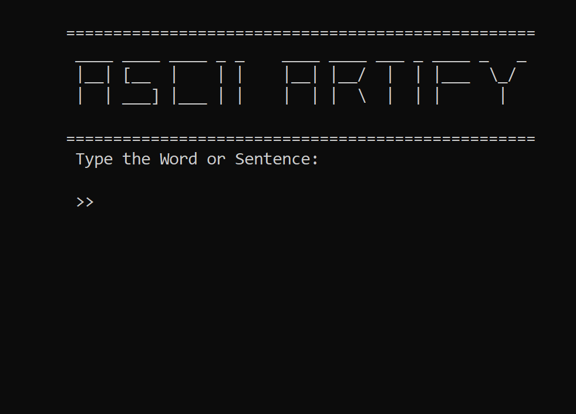
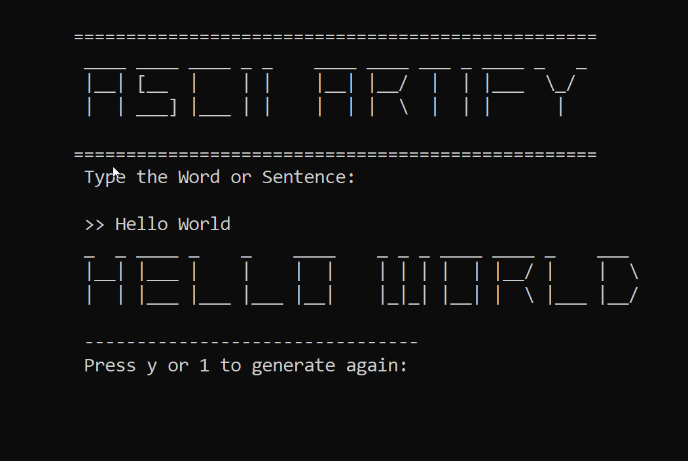
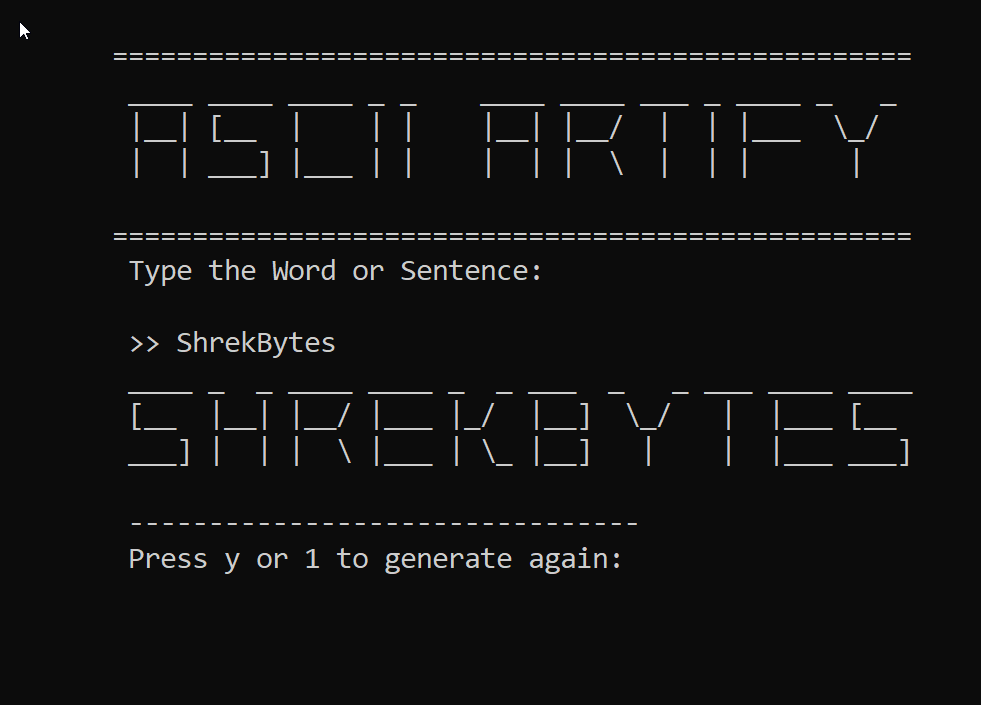

# ASCII Artify

ASCII Artify is a program written in C that converts input text into ASCII art. It allows you to create visually appealing representations of words and sentences using English alphabets, along with specific symbols.

## Features
- **ASCII Art Conversion**: The program converts input text into ASCII art.
- **Character Support**: The program supports English alphabets (`a` to `z` and `A` to `Z`) along with specific symbols such as `-`, `_`, `:`, `.`, and `/`.
- **Customizable Array Size**: The `ARRAY_SIZE` constant in the code can be adjusted to accommodate longer input strings.
- **Interactive User Interface**: The program provides an interactive user interface where you can enter the word or sentence to convert into ASCII art. After generating the art, you have the option to generate more arts by simply pressing `y` or `1`.
- **Clear Screen Function**: Before generating new ASCII art, the program clears the console or terminal screen, providing a clean and organized display for each iteration.
- **Easy Integration**: The code can be easily integrated into your projects or used as a standalone program.
- **Readability**: The code is structured with clear function names and comments, making it easy to understand and modify for further customization.

## Screenshots
Here are some screenshots showcasing the project's user interface:

|  |  |
|---|---|
|  | 
and more...
 |

## Dependencies
- The application requires a C compiler to compile and run the source code.
- The code has been tested on both Windows and Linux systems.

